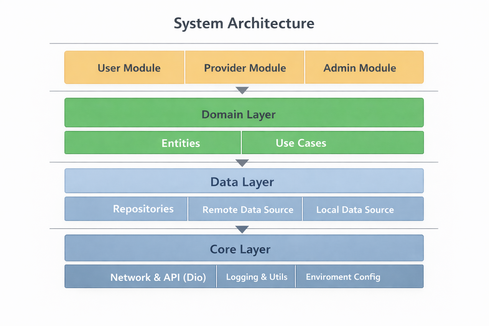
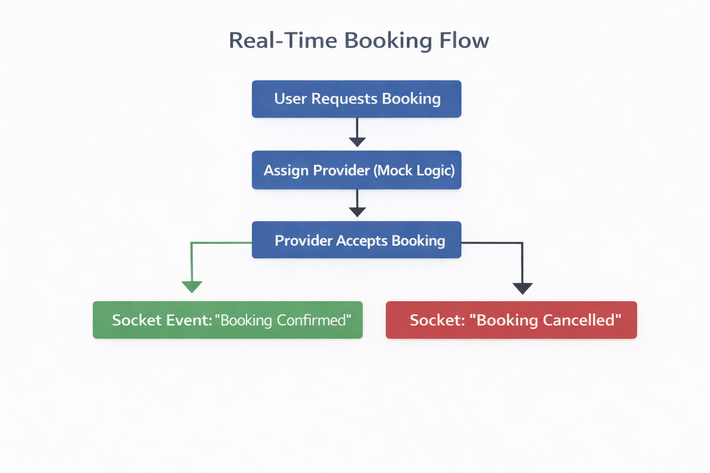
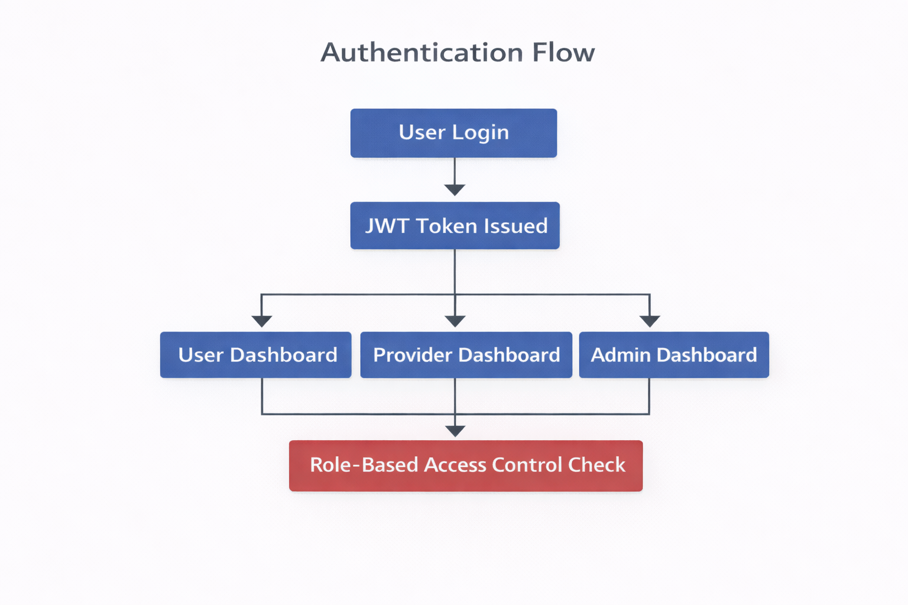

# Enterprise Booking System

> Production-ready Flutter enterprise booking system demonstrating Clean Architecture, scalability, and real-time system handling.

## Project Overview

The Enterprise Booking System is a multi-role booking platform designed for enterprise-scale applications. It supports three distinct user roles (User, Provider, Admin) and demonstrates production-grade architecture patterns suitable for scaling to millions of users.

**Business Problem**: Organizations need a robust, scalable booking system that can handle real-time updates, support multiple user roles, and maintain code quality as the team and feature set grows.

**Solution**: A Clean Architecture-based Flutter application with clear separation of concerns, dependency injection, and abstraction layers that enable independent scaling of components and easy testing.

---

## Architecture Diagram



### Architecture Layers

#### **Presentation Layer**
- **Responsibility**: UI components, state management (GetX), user interactions
- **Components**: Screens, Controllers, Widgets
- **Dependencies**: Domain layer only
- **Key Features**:
  - Role-based routing (User/Provider/Admin)
  - Reactive state management with GetX
  - Real-time UI updates via socket subscriptions

#### **Domain Layer**
- **Responsibility**: Business logic, entities, use cases
- **Components**: Entities, Use Cases, Repository Interfaces
- **Dependencies**: None (pure Dart)
- **Key Features**:
  - Business rule validation
  - Use case orchestration
  - Domain entities representing core business concepts

#### **Data Layer**
- **Responsibility**: Data access, API communication, caching
- **Components**: Models, Repository Implementations, Data Sources
- **Dependencies**: Domain layer, Core layer
- **Key Features**:
  - RESTful API integration via Dio
  - JSON serialization/deserialization
  - Data transformation (Model → Entity)

#### **Core Layer**
- **Responsibility**: Cross-cutting concerns, utilities, infrastructure
- **Components**: Network client, Logging, Storage, Environment config
- **Dependencies**: External packages only
- **Key Features**:
  - Centralized error handling
  - JWT token management
  - Environment-specific configuration
  - Logging abstraction

---

## Real-Time Booking Flow



### Booking Lifecycle

1. **User Creates Booking Request**
   - User selects service type, date/time, and optional details
   - System validates business rules (future date, required fields)
   - Booking created with `pending` status

2. **Provider Assignment (Mock)**
   - System simulates provider assignment
   - Booking status transitions to `confirmed`
   - Real-time update sent via socket service

3. **Status Updates**
   - Provider accepts → `confirmed`
   - Service starts → `in_progress`
   - Service completes → `completed`
   - Cancellation → `cancelled`

4. **Real-Time Notifications**
   - Socket service broadcasts status changes
   - All subscribed clients receive updates instantly
   - UI updates reactively via GetX observables

---

## Authentication Flow



### JWT Authentication & Role-Based Access

1. **Login/Registration**
   - User provides credentials
   - Backend validates and returns JWT token + refresh token
   - Tokens stored securely in SharedPreferences
   - User role extracted from token payload

2. **Token Management**
   - Access token attached to all API requests via Dio interceptor
   - Automatic token refresh on 401 responses
   - Token expiration handling

3. **Role-Based Routing**
   - User → `/user/home` (booking management)
   - Provider → `/provider/home` (assigned bookings)
   - Admin → `/admin/home` (system-wide management)

4. **Session Persistence**
   - Tokens persisted across app restarts
   - Automatic re-authentication on app launch
   - Secure logout clears all stored credentials

---

## Clean Architecture Structure

```
lib/
├── core/                          # Cross-cutting concerns
│   ├── constants/
│   │   ├── app_constants.dart     # App-wide constants
│   │   ├── app_images.dart        # Asset paths
│   │   └── app_routes.dart        # Route definitions
│   ├── network/
│   │   └── dio_client.dart        # HTTP client with interceptors
│   ├── services/
│   │   ├── environment_config.dart # Environment configuration
│   │   ├── storage_service.dart   # Local storage abstraction
│   │   └── socket_service.dart    # Real-time updates (mock)
│   ├── logging/
│   │   └── app_logger.dart        # Logging abstraction
│   └── utils/
│       ├── result.dart            # Result type for error handling
│       └── date_formatter.dart   # Date formatting utilities
│
├── domain/                        # Business logic layer
│   ├── entities/
│   │   ├── user.dart              # User entity
│   │   ├── booking.dart           # Booking entity
│   │   └── auth_response.dart     # Auth response entity
│   ├── repositories/
│   │   ├── auth_repository.dart   # Auth repository interface
│   │   └── booking_repository.dart # Booking repository interface
│   └── usecases/
│       ├── auth/
│       │   ├── login_usecase.dart
│       │   └── register_usecase.dart
│       └── booking/
│           ├── create_booking_usecase.dart
│           ├── get_bookings_usecase.dart
│           └── update_booking_status_usecase.dart
│
├── data/                          # Data access layer
│   ├── models/
│   │   ├── user_model.dart        # User data model
│   │   ├── booking_model.dart     # Booking data model
│   │   └── auth_response_model.dart
│   ├── datasources/
│   │   ├── auth_remote_datasource.dart
│   │   └── booking_remote_datasource.dart
│   └── repositories/
│       ├── auth_repository_impl.dart
│       └── booking_repository_impl.dart
│
├── presentation/                  # UI layer
│   ├── controllers/
│   │   ├── auth_controller.dart   # Auth state management
│   │   └── booking_controller.dart # Booking state management
│   ├── auth/
│   │   └── screens/
│   │       └── login_screen.dart
│   ├── user/
│   │   └── screens/
│   │       ├── user_home_screen.dart
│   │       └── create_booking_screen.dart
│   ├── provider/
│   │   └── screens/
│   │       └── provider_home_screen.dart
│   └── admin/
│       └── screens/
│           └── admin_home_screen.dart
│
├── di/
│   └── app_module.dart            # Dependency injection setup
│
└── main.dart                      # Application entry point
```

---

## Tech Stack

- **Flutter** - Cross-platform UI framework
- **GetX** - State management, routing, dependency injection
- **Dio** - HTTP client with interceptors
- **SharedPreferences** - Local storage
- **Clean Architecture** - Separation of concerns, testability
- **Socket Structure (Mock)** - Real-time updates foundation

---

## Environment Configuration Strategy

The application supports multiple deployment environments through `EnvironmentConfig`:

### Development (`dev`)
- Mock data enabled
- Verbose logging
- Development API endpoints
- Debug features enabled

### Staging (`staging`)
- Production-like API endpoints
- Logging enabled
- Mock data disabled
- Pre-production testing

### Production (`production`)
- Production API endpoints
- Logging disabled (monitoring via external service)
- Mock data disabled
- Optimized performance

**Configuration**: Set environment via build flavors or environment variables before app initialization.

---

## Scalability & Design Decisions

### Why Repository Pattern?

The repository pattern abstracts data sources, enabling:
- **Multiple data sources**: Switch between API, local cache, or mock data without changing business logic
- **Testing**: Easy to mock repositories for unit tests
- **Future-proofing**: Add caching layer, offline support, or GraphQL without touching domain layer

### Why Dependency Injection?

Using GetIt for DI provides:
- **Loose coupling**: Components depend on abstractions, not implementations
- **Testability**: Swap implementations for testing (e.g., mock repositories)
- **Maintainability**: Single source of truth for dependencies
- **Lifecycle management**: Proper initialization order and cleanup

### Why Abstraction Layers?

Each layer has clear responsibilities:
- **Domain layer**: Pure business logic, no framework dependencies
- **Data layer**: Handles external concerns (API, storage, serialization)
- **Presentation layer**: UI concerns only, delegates business logic to use cases
- **Core layer**: Reusable infrastructure components

### How It Supports Scaling

1. **Horizontal Scaling**: Stateless architecture allows multiple app instances
2. **Team Scaling**: Clear boundaries enable parallel development
3. **Feature Scaling**: New features follow established patterns
4. **Performance Scaling**: Easy to add caching, pagination, lazy loading
5. **Technology Scaling**: Swap implementations (e.g., BLoC instead of GetX) without touching domain layer

---

## How to Run

### Prerequisites

- Flutter SDK (3.8.0 or higher)
- Dart SDK (3.8.0 or higher)
- Android Studio / Xcode (for mobile builds)
- VS Code / Android Studio (IDE)

### Setup Steps

1. **Clone the repository**
   ```bash
   git clone <repository-url>
   cd enterprise_booking
   ```

2. **Install dependencies**
   ```bash
   flutter pub get
   ```

3. **Configure environment** (optional)
   - Edit `lib/core/services/environment_config.dart`
   - Update API endpoints for your backend

4. **Run the application**
   ```bash
   flutter run
   ```

### Mock Backend Setup

For Phase 1, the application uses mock responses. To connect to a real backend:

1. Update `EnvironmentConfig` with your API endpoints
2. Ensure backend implements the following endpoints:
   - `POST /auth/login`
   - `POST /auth/register`
   - `POST /auth/refresh`
   - `GET /bookings`
   - `POST /bookings`
   - `PUT /bookings/:id/status`
   - `PUT /bookings/:id/assign`
   - `DELETE /bookings/:id`

### Example Backend Response

**Login Response:**
```json
{
  "token": "eyJhbGciOiJIUzI1NiIsInR5cCI6IkpXVCJ9...",
  "refresh_token": "refresh_token_here",
  "user": {
    "id": "user_123",
    "email": "user@example.com",
    "name": "John Doe",
    "role": "user",
    "created_at": "2024-01-01T00:00:00Z"
  }
}
```

**Booking List Response:**
```json
{
  "data": [
    {
      "id": "booking_123",
      "user_id": "user_123",
      "provider_id": "provider_456",
      "service_type": "Consultation",
      "scheduled_at": "2024-02-20T10:00:00Z",
      "status": "confirmed",
      "notes": "Please arrive 10 minutes early",
      "location": "123 Main St",
      "amount": 100.00,
      "created_at": "2024-02-19T08:00:00Z",
      "updated_at": "2024-02-19T09:00:00Z"
    }
  ],
  "page": 1,
  "limit": 20,
  "total": 1
}
```

---

## Future Roadmap

### Phase 2: Testing & Quality
- [ ] Unit tests for use cases (90%+ coverage)
- [ ] Widget tests for critical screens
- [ ] Integration tests for booking flow
- [ ] CI/CD pipeline setup

### Phase 3: Performance & Caching
- [ ] Local caching layer (Hive/SQLite)
- [ ] Offline-first architecture
- [ ] Image caching and optimization
- [ ] Pagination for large lists

### Phase 4: Real-Time Infrastructure
- [ ] WebSocket integration (replace mock)
- [ ] Push notifications (FCM)
- [ ] Background sync service
- [ ] Real-time analytics

### Phase 5: Enterprise Features
- [ ] Multi-language support (i18n)
- [ ] Dark mode
- [ ] Advanced analytics dashboard
- [ ] Audit logging
- [ ] Role-based permissions (granular)

### Phase 6: Microservice-Ready Backend
- [ ] API Gateway integration
- [ ] Service mesh support
- [ ] Distributed tracing
- [ ] Event-driven architecture

---

## Contributing

This repository demonstrates enterprise-grade Flutter architecture. When contributing:

1. Follow Clean Architecture principles
2. Write tests for new use cases
3. Update documentation for API changes
4. Maintain separation of concerns
5. Use dependency injection for new features

---

## Usage Notice

This repository is created for portfolio and architecture demonstration purposes only.
Business logic and production code are not included.

---

## Contact

Aditya Verma
Senior Flutter Developer | Cross-Platform Mobile Engineer
Helping Startups Build Scalable, Real-Time & High-Performance Apps

📧 adityaverma15.cs@gmail.com

🔗 LinkedIn: https://www.linkedin.com/in/aditya-verma-122318212/
🌍 Available for Freelance & Remote Projects

---

**Built with Clean Architecture principles for scalability, maintainability, and testability.**
